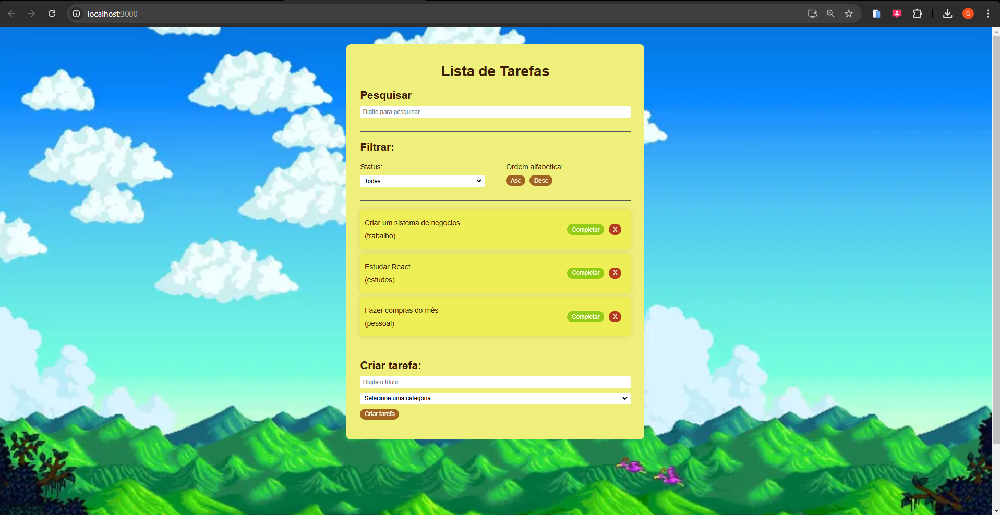

# **Gerenciador de Tarefas**

Um Gerenciador de Tarefas Simples, desenvolvido com React, HTML, CSS e JavaScript, para praticar habilidades front-end e organizar tarefas de maneira eficiente.

---

## **Índice**
1. [Descrição](#descrição)
2. [Demonstração](#demonstração)
3. [Funcionalidades](#funcionalidades)
4. [Tecnologias Utilizadas](#tecnologias-utilizadas)
5. [Como Executar o Projeto](#como-executar-o-projeto)

---

## **Descrição**

Este projeto é um estudo de caso para aprender e aplicar os conceitos de desenvolvimento front-end utilizando o **React**. A aplicação permite ao usuário adicionar, editar, excluir e organizar suas tarefas de forma intuitiva, oferecendo uma interface simples e funcional.

---

## **Demonstração**



---

## **Funcionalidades**

- ✅ Adicionar novas tarefas.  
- ✅ Marcar tarefas como concluídas.  
- ✅ Excluir tarefas.  
- ✅ Salvar dados localmente no navegador usando **localStorage**.  

---

## **Tecnologias Utilizadas**

- **React**: Framework JavaScript para construção de interfaces.  
- **HTML5**: Estrutura da aplicação.  
- **CSS3**: Estilização da interface.  
- **JavaScript (ES6+)**: Lógica da aplicação e manipulação de dados.  

---

## **Como Executar o Projeto**

### **Pré-requisitos**
- **Node.js** (versão 16 ou superior).  
- npm (ou yarn) instalado.

---

### **Clonar o Repositório**
Execute os comandos abaixo no terminal:

```bash
git clone https://github.com/seu-usuario/gerenciador-de-tarefas.git
cd gerenciador-de-tarefas
>>>>>>> 3a9524dd8e4fab840d9efdcbda44d1a9746183d4
